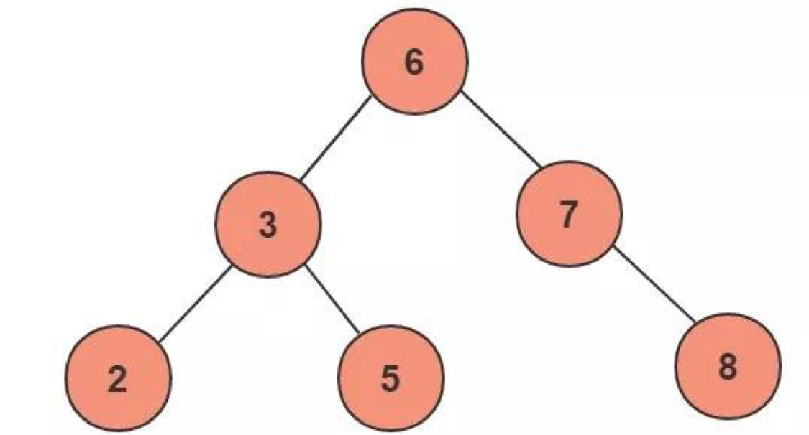
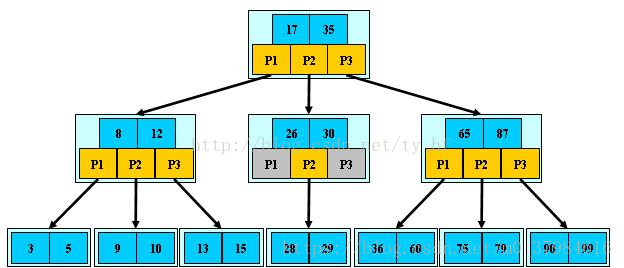
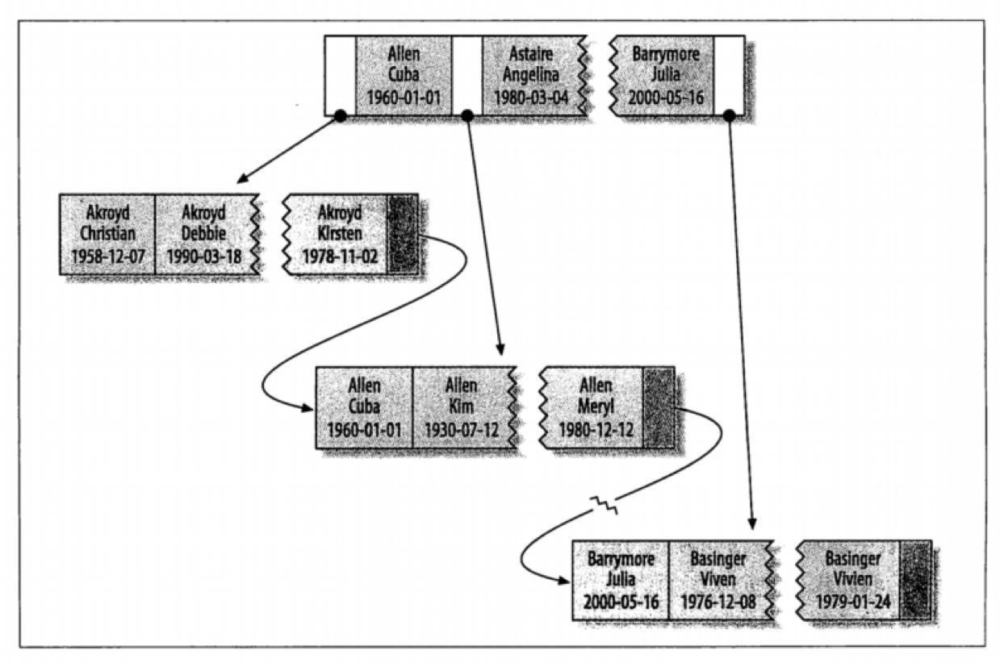

# 索引

索引（Index）是帮助MySQL高效获取数据的数据结构。索引是在存储引擎中实现的，不同的存储引擎，使用不同的索引。

MyISAM和InnoDB 只支持BTREE索引，也就是说默认使用BTREE，不能够更换；MEMORY/HEAP支持HASH和BTREE索引。

## 类型
- 普通索引：B+Tree索引，最常用的索引
- 唯一索引：索引列中的值必须是唯一的，允许为空值
- 主键索引：特殊的唯一索引，不允许有空值
- 组合索引：在表中的多个字段组合上创建的索引，只有在查询条件中使用了这些字段的左边字段时，索引才会被使用，使用组合索引时遵循最左前缀集合
- 全文索引：只有在MyISAM引擎上才能使用，只能在CHAR,VARCHAR,TEXT类型字段上使用全文索引，在一堆文字中，通过其中的某个关键字等，就能找到该字段所属的记录行。
- 空间索引：空间索引是对空间数据类型的字段建立的索引，MySQL中的空间数据类型有四种，GEOMETRY、POINT、LINESTRING、POLYGON。在创建空间索引时，使用SPATIAL关键字。要求，引擎为MyISAM，创建空间索引的列，必须将其声明为NOT NULL。
- 哈希索引：类似hashmap，只能做等值查询

## 二叉树
二叉树是每个结点最多有两个子树的树结构。通常子树被称作“左子树”（left subtree）和“右子树”（right subtree）。二叉树常被用于实现二叉查找树和二叉堆。

一棵深度为k，且有2^k-1个节点的二叉树，称为满二叉树。这种树的特点是每一层上的节点数都是最大节点数。

在一棵二叉树中，除最后一层外，若其余层都是满的，并且最后一层或者是满的，或者是在右边缺少连续若干节点，则此二叉树为完全二叉树。具有n个节点的完全二叉树的深度为floor(log2n)+1。深度为k的完全二叉树，至少有2k-1个叶子节点，至多有2k-1个节点。

> 最基本的查询算法是顺序查找（linear search），但这种复杂度为O(n)的算法在数据量很大时显然是糟糕的，好在计算机科学的发展提供了很多更优秀的查找算法，例如二分查找（binary search）、二叉树查找（binary tree search）等。如果稍微分析一下会发现，每种查找算法都只能应用于特定的数据结构之上，例如二分查找要求被检索数据有序，而二叉树查找只能应用于二叉查找树上，但是数据本身的组织结构不可能完全满足各种数据结构（例如，理论上不可能同时将两列都按顺序进行组织），所以，在数据之外，数据库系统还维护着满足特定查找算法的数据结构，这些数据结构以某种方式引用（指向）数据，这样就可以在这些数据结构上实现高级查找算法。这种数据结构，就是索引。

下图展示了一种可能的索引方式：左边是数据表，一共有两列七条记录，最左边的是数据记录的物理地址。为了加快Col2的查找，可以维护一个右边所示的二叉查找树，每个节点分别包含索引键值和一个指向对应数据记录物理地址的指针，这样就可以运用二叉查找在O(log_2n)的复杂度内获取到相应数据。

虽然这是一个货真价实的索引，但是实际的数据库系统几乎没有使用二叉查找树或其进化品种红黑树（red-black tree）实现的。

需要注意的是：树必须是平衡的；为了减少IO，层次不能太深。

## B-Tree

为了描述B-Tree，首先定义一条数据记录为一个二元组[key, data]，key为记录的键值，对于不同数据记录，key是互不相同的；data为数据记录除key外的数据。那么B-Tree是满足下列条件的数据结构：
- d为大于1的一个正整数，称为B-Tree的度
- h为一个正整数，称为B-Tree的高度
- 每个非叶子节点由n-1个key和n个指针组成，其中d<=n<=2d
- 每个叶子节点最少包含一个key和两个指针，最多包含2d-1个key和2d个指针，叶节点的指针均为null
- 所有叶节点具有相同的深度，等于树高h
- key和指针互相间隔，节点两端是指针
- 一个节点中的key从左到右非递减排列
- 所有节点组成树结构
- 每个指针要么为null，要么指向另外一个节点
- 如果某个指针在节点node最左边且不为null，则其指向节点的所有key小于v(key_1)，其中v(key_1)为node的第一个key的值
- 如果某个指针在节点node最右边且不为null，则其指向节点的所有key大于v(key_m)，其中v(key_m)为node的最后一个key的值
- 如果某个指针在节点node的左右相邻key分别是key_i和key_{i+1}且不为null，则其指向节点的所有key小于v(key_{i+1})且大于v(key_i)

下图是一个d=2的B-Tree示意图：

由于B-Tree的特性，在B-Tree中按key检索数据的算法非常直观：首先从根节点进行二分查找，如果找到则返回对应节点的data，否则对相应区间的指针指向的节点递归进行查找，直到找到节点或找到null指针，前者查找成功，后者查找失败。

由于插入删除新的数据记录会破坏B-Tree的性质，因此在插入删除时，需要对树进行一个分裂、合并、转移等操作以保持B-Tree性质。

如果要查找数据项29，首先会把磁盘块1由磁盘加载到内存，发生一次IO，在内存中用二分查找确定29在17和35之间，锁定磁盘块1的P2指针，内存时间因为非常短（相比磁盘的IO）可以忽略不计，通过磁盘块1的P2指针的磁盘地址把磁盘块3由磁盘加载到内存，发生第二次IO，29在26和30之间，锁定磁盘块3的P2指针，通过指针加载磁盘块8到内存，发生第三次IO，同时内存中做二分查找找到29，结束查询，总计三次IO。

# B+Tree

B+Tree是B-Tree的一个变种，不同点：
- 每个节点的指针上限为2d而不是2d+1
- 内节点不存储data，只存储key，data存储在叶子节点
- 叶子节点不存储指针

由于并不是所有节点都具有相同的域，因此B+Tree中叶节点和内节点一般大小不同。这点与B-Tree不同，虽然B-Tree中不同节点存放的key和指针可能数量不一致，但是每个节点的域和上限是一致的，所以在实现中B-Tree往往对每个节点申请同等大小的空间。

一般在数据库系统或文件系统中使用的B+Tree结构都在经典B+Tree的基础上进行了优化，增加了顺序访问指针。

如图所示，在B+Tree的每个叶子节点增加一个指向相邻叶子节点的指针，就形成了带有顺序访问指针的B+Tree。做这个优化的目的是为了提高区间访问的性能，例如如果要查询key为从18到49的所有数据记录，当找到18后，只需顺着节点和指针顺序遍历就可以一次性访问到所有数据节点，极大提到了区间查询效率。

## B-Tree & B+Tree

B+Tree比B-Tree更适合实现外存储索引结构，具体原因与外存储器原理及计算机存取原理有关。

一般来说，索引本身也很大，不可能全部存储在内存中，因此索引往往以索引文件的形式存储的磁盘上。这样的话，索引查找过程中就要产生磁盘I/O消耗，相对于内存存取，I/O存取的消耗要高几个数量级，所以评价一个数据结构作为索引的优劣最重要的指标就是在查找过程中磁盘I/O操作次数的渐进复杂度。所以，索引的结构组织要尽量减少查找过程中磁盘I/O的存取次数。

上文说过一般使用磁盘I/O次数评价索引结构的优劣。先从B-Tree分析，根据B-Tree的定义，可知检索一次最多需要访问h个节点。数据库系统的设计者巧妙利用了磁盘预读原理，将一个节点的大小设为等于一个页，这样每个节点只需要一次I/O就可以完全载入。为了达到这个目的，在实际实现B-Tree还需要使用如下技巧：

每次新建节点时，直接申请一个页的空间，这样就保证一个节点物理上也存储在一个页里，加之计算机存储分配都是按页对齐的，就实现了一个node只需一次I/O。

B-Tree中一次检索最多需要h-1次I/O（根节点常驻内存），渐进复杂度为O(h)=O(logdN)。一般实际应用中，出度d是非常大的数字，通常超过100，因此h非常小（通常不超过3）。

综上所述，用B-Tree作为索引结构效率是非常高的。

而红黑树这种结构，h明显要深的多。由于逻辑上很近的节点（父子）物理上可能很远，无法利用局部性，所以红黑树的I/O渐进复杂度也为O(h)，效率明显比B-Tree差很多。

B+Tree更适合外存索引，原因和内节点d有关。从上面分析可以看到，d越大索引的性能越好，而d的上限取决于节点内key和data的大小：

`dmax=floor(pagesize/(keysize+datasize+pointsize))`

floor表示向下取整。由于B+Tree内节点去掉了data域，因此可以拥有更大的d，拥有更好的性能。

## MyISAM

MyISAM引擎使用B+Tree作为索引结构，叶节点的data域存放的是数据记录的地址。MyISAM索引文件和数据文件是分离的，索引文件仅保存数据记录的地址。

假设有一张有3列的表，以Col1为主键，则下图是一个MyISAM表的主索引（Primary key）示意。可以看出MyISAM的索引文件仅仅保存数据记录的地址。

在MyISAM中，主索引和辅助索引（Secondary key）在结构上没有任何区别，只是主索引要求key是唯一的，而辅助索引的key可以重复。如果我们在Col2上建立一个辅助索引，则此索引的结构如下图所示：

同样也是一颗B+Tree，data域保存数据记录的地址。因此，MyISAM中索引检索的算法为首先按照B+Tree搜索算法搜索索引，如果指定的Key存在，则取出其data域的值，然后以data域的值为地址，读取相应数据记录。

MyISAM的索引方式也叫做“非聚集”的，之所以这么称呼是为了与InnoDB的聚集索引区分。

## InnoDB

在InnoDB中，表数据文件本身就是按B+Tree组织的一个索引结构，这棵树的叶节点data域保存了完整的数据记录，数据文件即为索引文件。这个索引的key是数据表的主键，因此InnoDB表数据文件本身就是主索引。

上图是InnoDB主索引（同时也是数据文件）的示意图，可以看到叶节点包含了完整的数据记录。这种索引叫做聚集索引。因为InnoDB的数据文件本身要按主键聚集，所以InnoDB要求表必须有主键（MyISAM可以没有），如果没有显式指定，则MySQL系统会自动选择一个可以唯一标识数据记录的列作为主键，如果不存在这种列，则MySQL自动为InnoDB表生成一个隐含字段作为主键，这个字段长度为6个字节，类型为长整形。

InnoDB的辅助索引data域存储相应记录主键的值而不是地址。换句话说，InnoDB的所有辅助索引都引用主键作为data域。

这里以英文字符的ASCII码作为比较准则。聚集索引这种实现方式使得按主键的搜索十分高效，但是辅助索引搜索需要检索两遍索引：首先检索辅助索引获得主键，然后用主键到主索引中检索获得记录。

在InnoDB中，不建议使用过长的字段作为主键，因为所有辅助索引都引用主索引，过长的主索引会令辅助索引变得过大。

不建议使用非单调的字段作为主键，因为InnoDB数据文件本身是一颗B+Tree，非单调的主键会造成在插入新记录时数据文件为了维持B+Tree的特性而频繁的分裂调整，十分低效，而使用自增字段作为主键则是一个很好的选择。

由于数据和叶子节点存储在一起，这样主键和行数据是一起被载入内存的，找到叶节点就可以立刻将行数据返回了，使用主键查询获得数据更快。

辅助索引使用主键作为"指针"，而不是使用地址值作为指针的好处是，减少了当出现行移动或者数据页分裂时辅助索引的维护工作，使用主键值当作指针会让辅助索引占用更多的空间，换来的好处是InnoDB在移动行时无须更新辅助索引中的这个"指针"。也就是说行的位置会随着数据库里数据的修改而发生变化，使用聚簇索引就可以保证不管这个主键B+树的节点如何变化，辅助索引树都不受影响。

## 联合索引

高效使用索引的首要条件是知道什么样的查询会使用到索引，这个问题和B+Tree中的“最左前缀原理”有关。

这里先说一下联合索引的概念。在上文中，我们都是假设索引只引用了单个的列，实际上，MySQL中的索引可以以一定顺序引用多个列，这种索引叫做联合索引，一般的，一个联合索引是一个有序元组`<a1, a2, …, an>`，其中各个元素均为数据表的一列。单列索引可以看成联合索引元素数为1的特例。

## 优化
TODO

## 查询
TODO

http://blog.codinglabs.org/articles/theory-of-mysql-index.html

