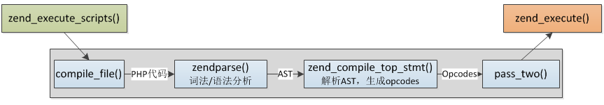
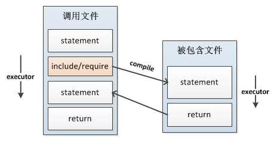
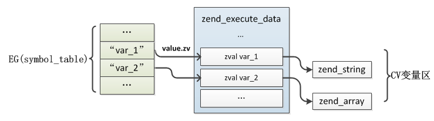
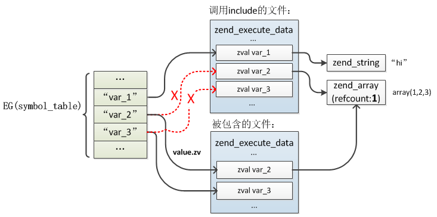
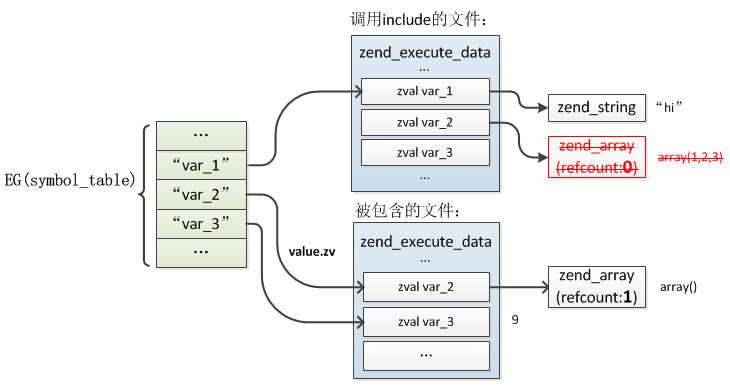
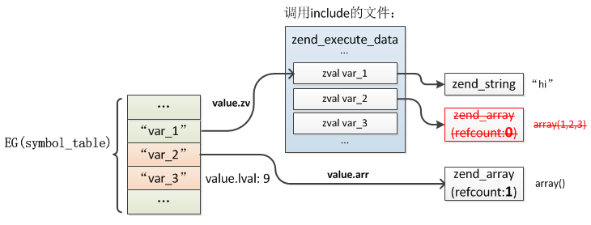
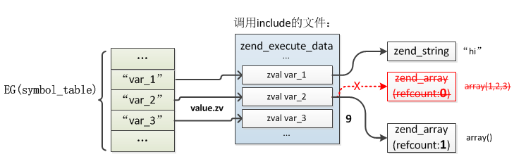

# include&require

include、require 包含指定文件，被包含文件先按参数给出的路径寻找，如果没有给出目录（只有文件名）时则按照 include_path 指定的目录寻找。如果在 include_path 下没找到该文件则 include 最后才在调用脚本文件所在的目录和当前工作目录下寻找。

如果定义了路径，不管是绝对路径还是当前目录的相对路径，include_path 都会被完全忽略。例如一个文件以 ../ 开头，则解析器会在当前目录的父目录下寻找该文件。

当一个文件被包含时，其中所包含的代码继承了 include 所在行的变量范围。从该处开始，调用文件在该行处可用的任何变量在被调用的文件中也都可用。不过所有在包含文件中定义的函数和类都具有全局作用域。

include是在运行时加载文件并执行的，而不是在编译时。

可以理解 include 就是把其它文件的内容拷贝到了调用文件中，类似C语言中的宏(当然执行的时候并不是这样)。

## 区别

require 和 include 几乎完全一样，只是处理失败的方式不同。require 在出错（未找到文件）时产生 E_COMPILE_ERROR 级别的错误。换句话说将导致脚本中止而 include 只产生警告（E_WARNING），脚本会继续运行。

include_once、require_once 与 include、require的区别是在一次请求中同一文件只会被加载一次，第一次执行时会把这个文件保存在EG(included_files)哈希表中，再次加载时检查这个哈希表，如果发现已经加载过则直接跳过。

## 原理

PHP版本`7.2.7`，PHP示例：
```php
//a.php
$var_1 = "hi";
$var_2 = array(1,2,3);

include 'b.php';

var_dump($var_2);
var_dump($var_3);

//b.php
$var_2 = array();
$var_3 = 9;
```

执行php a.php结果显示`$var_2`值被修改为`array()`了，而include文件中新定义的`$var_3`也可以在调用文件中使用。

Zend引擎有编译、执行两个阶段，整个过程的输入是一个文件，然后经过`PHP代码->AST->Opcodes->execute`一系列过程完成整个处理，编译过程的输入是一个文件，输出是zend_op_array，输出接着成为执行过程的输入，而include的处理实际就是这个过程，执行include时把被包含的文件像主脚本一样编译然后执行，接着在回到调用处继续执行。





### 流程
通过OPCODE工具可以看到，include的编译过程非常简单，只编译为一条opcode：`ZEND_INCLUDE_OR_EVAL`，`INCLUDE_OR_EVAL`对应的执行函数是`ZEND_INCLUDE_OR_EVAL_SPEC_CONST_HANDLER`。

在`Zend/zend_vm_execute.h`中查看函数源码：
```c
static ZEND_OPCODE_HANDLER_RET ZEND_FASTCALL ZEND_INCLUDE_OR_EVAL_SPEC_CONST_HANDLER(ZEND_OPCODE_HANDLER_ARGS)
{
	USE_OPLINE
	//include文件编译的zend_op_array
	zend_op_array *new_op_array;

	zval *inc_filename;

	SAVE_OPLINE();
	inc_filename = EX_CONSTANT(opline->op1);
	// 编译include的文件
	new_op_array = zend_include_or_eval(inc_filename, opline->extended_value);

	if (UNEXPECTED(EG(exception) != NULL)) {
		if (new_op_array != ZEND_FAKE_OP_ARRAY && new_op_array != NULL) {
			destroy_op_array(new_op_array);
			efree_size(new_op_array, sizeof(zend_op_array));
		}
		UNDEF_RESULT();
		HANDLE_EXCEPTION();
	} else if (new_op_array == ZEND_FAKE_OP_ARRAY) {
		if (RETURN_VALUE_USED(opline)) {
			ZVAL_TRUE(EX_VAR(opline->result.var));
		}
	} else if (EXPECTED(new_op_array != NULL)) {
		zval *return_value = NULL;
		zend_execute_data *call;

		if (RETURN_VALUE_USED(opline)) {
			return_value = EX_VAR(opline->result.var);
			ZVAL_NULL(return_value);
		}

		new_op_array->scope = EX(func)->op_array.scope;

		//分配运行时的zend_execute_data
		call = zend_vm_stack_push_call_frame(ZEND_CALL_NESTED_CODE | ZEND_CALL_HAS_SYMBOL_TABLE,
			(zend_function*)new_op_array, 0,
			Z_TYPE(EX(This)) != IS_OBJECT ? Z_CE(EX(This)) : NULL,
			Z_TYPE(EX(This)) == IS_OBJECT ? Z_OBJ(EX(This)) : NULL);

	    //继承调用文件的全局变量符号表
		if (EX_CALL_INFO() & ZEND_CALL_HAS_SYMBOL_TABLE) {
			call->symbol_table = EX(symbol_table);
		} else {
			call->symbol_table = zend_rebuild_symbol_table();
		}

		//保存当前zend_execute_data，include执行完再还原
		call->prev_execute_data = execute_data;

		//执行前初始化
		i_init_code_execute_data(call, new_op_array, return_value);

		//zend_execute_ex执行器入口，如果没有自定义这个函数则默认为execute_ex()
		if (EXPECTED(zend_execute_ex == execute_ex)) {
			//将执行器切到新的zend_execute_data，回忆下execute_ex()中的切换过程
			ZEND_VM_ENTER();
		} else {
			ZEND_ADD_CALL_FLAG(call, ZEND_CALL_TOP);
			zend_execute_ex(call);
			zend_vm_stack_free_call_frame(call);
		}

		destroy_op_array(new_op_array);
		efree_size(new_op_array, sizeof(zend_op_array));
		if (UNEXPECTED(EG(exception) != NULL)) {
			zend_rethrow_exception(execute_data);
			UNDEF_RESULT();
			HANDLE_EXCEPTION();
		}
	} else if (RETURN_VALUE_USED(opline)) {
		ZVAL_FALSE(EX_VAR(opline->result.var));
	}
	ZEND_VM_SET_OPCODE(opline + 1);
	ZEND_VM_CONTINUE();
}
```

执行的过程实际非常像函数的调用过程，首先也是重新分配了一个`zend_execute_data`，然后将执行器切到新的`zend_execute_data`，执行完以后再切回调用处。

编译include文件是调用`zend_include_or_eval()`函数：

```c
static zend_never_inline zend_op_array* ZEND_FASTCALL zend_include_or_eval(zval *inc_filename, int type) /* {{{ */
{
	zend_op_array *new_op_array = NULL;
	zval tmp_inc_filename;

	ZVAL_UNDEF(&tmp_inc_filename);
	if (Z_TYPE_P(inc_filename) != IS_STRING) {
		ZVAL_STR(&tmp_inc_filename, zval_get_string(inc_filename));
		inc_filename = &tmp_inc_filename;
	}

	if (type != ZEND_EVAL && strlen(Z_STRVAL_P(inc_filename)) != Z_STRLEN_P(inc_filename)) {
        // 文件名错误
		if (type == ZEND_INCLUDE_ONCE || type == ZEND_INCLUDE) {
			zend_message_dispatcher(ZMSG_FAILED_INCLUDE_FOPEN, Z_STRVAL_P(inc_filename));
		} else {
			zend_message_dispatcher(ZMSG_FAILED_REQUIRE_FOPEN, Z_STRVAL_P(inc_filename));
		}
	} else {
		switch (type) {
			case ZEND_INCLUDE_ONCE:
			case ZEND_REQUIRE_ONCE: {
					zend_file_handle file_handle;
					zend_string *resolved_path;

					resolved_path = zend_resolve_path(Z_STRVAL_P(inc_filename), (int)Z_STRLEN_P(inc_filename));
					if (resolved_path) {
                        // 文件存在 EG(included_files)哈希表中，直接跳过，编译完成
						if (zend_hash_exists(&EG(included_files), resolved_path)) {
							goto already_compiled;
						}
					} else {
						resolved_path = zend_string_copy(Z_STR_P(inc_filename));
					}

					if (SUCCESS == zend_stream_open(ZSTR_VAL(resolved_path), &file_handle)) {

						if (!file_handle.opened_path) {
							file_handle.opened_path = zend_string_copy(resolved_path);
						}
                        // 将文件保存到EG(included_files)哈希表中，并开始编译
						if (zend_hash_add_empty_element(&EG(included_files), file_handle.opened_path)) {
                            //将include文件的PHP代码编译成opcodes
							zend_op_array *op_array = zend_compile_file(&file_handle, (type==ZEND_INCLUDE_ONCE?ZEND_INCLUDE:ZEND_REQUIRE));
							zend_destroy_file_handle(&file_handle);
							zend_string_release(resolved_path);
							if (Z_TYPE(tmp_inc_filename) != IS_UNDEF) {
								zend_string_release(Z_STR(tmp_inc_filename));
							}
							return op_array;
						} else {
							zend_file_handle_dtor(&file_handle);
already_compiled:
							new_op_array = ZEND_FAKE_OP_ARRAY;
						}
					} else {
						if (type == ZEND_INCLUDE_ONCE) {
							zend_message_dispatcher(ZMSG_FAILED_INCLUDE_FOPEN, Z_STRVAL_P(inc_filename));
						} else {
							zend_message_dispatcher(ZMSG_FAILED_REQUIRE_FOPEN, Z_STRVAL_P(inc_filename));
						}
					}
					zend_string_release(resolved_path);
				}
				break;
			case ZEND_INCLUDE:
			case ZEND_REQUIRE:
                //编译include文件
				new_op_array = compile_filename(type, inc_filename);
				break;
			case ZEND_EVAL: {
					char *eval_desc = zend_make_compiled_string_description("eval()'d code");
					new_op_array = zend_compile_string(inc_filename, eval_desc);
					efree(eval_desc);
				}
				break;
			EMPTY_SWITCH_DEFAULT_CASE()
		}
	}
	if (Z_TYPE(tmp_inc_filename) != IS_UNDEF) {
		zend_string_release(Z_STR(tmp_inc_filename));
	}
	return new_op_array;
}
/* }}} */
```

```c
zend_op_array *compile_filename(int type, zval *filename)
{
	zend_file_handle file_handle;
	zval tmp;
	zend_op_array *retval;
	zend_string *opened_path = NULL;

	if (Z_TYPE_P(filename) != IS_STRING) {
		tmp = *filename;
		zval_copy_ctor(&tmp);
		convert_to_string(&tmp);
		filename = &tmp;
	}
	file_handle.filename = Z_STRVAL_P(filename);
	file_handle.free_filename = 0;
	file_handle.type = ZEND_HANDLE_FILENAME;
	file_handle.opened_path = NULL;
	file_handle.handle.fp = NULL;

    //将include文件的PHP代码编译成opcodes
	retval = zend_compile_file(&file_handle, type);
	if (retval && file_handle.handle.stream.handle) {
		if (!file_handle.opened_path) {
			file_handle.opened_path = opened_path = zend_string_copy(Z_STR_P(filename));
		}

        // 将文件保存到EG(included_files)哈希表中，并开始编译
		zend_hash_add_empty_element(&EG(included_files), file_handle.opened_path);

		if (opened_path) {
			zend_string_release(opened_path);
		}
	}
	zend_destroy_file_handle(&file_handle);

	if (filename==&tmp) {
		zval_dtor(&tmp);
	}
	return retval;
}
```
`zend_compile_file`是一个全局的函数指针，它的作用就是执行PHP代码文件解析完的转成的zend_op_array。在PHP内核启动时(zend_startup)时，这个全局函数指针将会指向compile_file函数。
```c
zend_compile_file = compile_file;
zend_execute_ex = execute_ex;
zend_execute_internal = NULL;
```

```c
ZEND_API zend_op_array *compile_file(zend_file_handle *file_handle, int type)
{
	zend_lex_state original_lex_state;
	zend_op_array *op_array = NULL;
	zend_save_lexical_state(&original_lex_state);

	if (open_file_for_scanning(file_handle)==FAILURE) {
		if (type==ZEND_REQUIRE) {
			zend_message_dispatcher(ZMSG_FAILED_REQUIRE_FOPEN, file_handle->filename);
			zend_bailout();
		} else {
			zend_message_dispatcher(ZMSG_FAILED_INCLUDE_FOPEN, file_handle->filename);
		}
	} else {
		op_array = zend_compile(ZEND_USER_FUNCTION);
	}

	zend_restore_lexical_state(&original_lex_state);
	return op_array;
}
```

### 报错
可以看到如果文件不存在，对require和include 抛出的异常类型是不一样的：
```c
zend_message_dispatcher(ZMSG_FAILED_REQUIRE_FOPEN, ...);
zend_message_dispatcher(ZMSG_FAILED_INCLUDE_FOPEN, ...);

BEGIN_EXTERN_C()
ZEND_API void zend_message_dispatcher(zend_long message, const void *data) /* {{{ */
{
	if (zend_message_dispatcher_p) {
		zend_message_dispatcher_p(message, data);
	}
}
/* }}} */
END_EXTERN_C()

```

函数`zend_message_dispatcher_p`是一个别名：`zend_message_dispatcher_p = utility_functions->message_handler;`

在 `main.c` 中 `php_module_startup()` 函数中有这样一条语句说明最终的 message handler 函数是 `php_message_handler_for_zend`：`zuf.message_handler = php_message_handler_for_zend;`

```c
/* {{{ php_message_handler_for_zend
 */
static ZEND_COLD void php_message_handler_for_zend(zend_long message, const void *data)
{
	switch (message) {
		case ZMSG_FAILED_INCLUDE_FOPEN:
			php_error_docref("function.include", E_WARNING, "Failed opening '%s' for inclusion (include_path='%s')", php_strip_url_passwd((char *) data), STR_PRINT(PG(include_path)));
			break;
		case ZMSG_FAILED_REQUIRE_FOPEN:
			php_error_docref("function.require", E_COMPILE_ERROR, "Failed opening required '%s' (include_path='%s')", php_strip_url_passwd((char *) data), STR_PRINT(PG(include_path)));
			break;
		case ZMSG_FAILED_HIGHLIGHT_FOPEN:
		case ZMSG_MEMORY_LEAK_DETECTED:
		case ZMSG_MEMORY_LEAK_REPEATED:
		case ZMSG_MEMORY_LEAKS_GRAND_TOTAL:
		case ZMSG_LOG_SCRIPT_NAME: 
	}
}
/* }}} */
```

可以看到`include`的报错级别为`E_WARNING`，`require`的报错级别为`E_COMPILE_ERROR`。

### 变量处理

如果include文件中只定义了函数、类，没有定义全局变量则执行过程实际直接执行return，只是在编译阶段将函数、类注册到EG(function_table)、EG(class_table)中了，属于比较简单的情况。

如果在include文件中有全局变量定义处理就比较复杂了，比如上面那个例子，两个文件中都定义了全局变量，这些变量是如何被继承、合并的呢？

上面的过程中还有一个关键操作：`i_init_code_execute_data()`，关于这个函数在前面介绍zend_execute()时曾提过，这里面除了一些上下文的设置还会把当前`zend_op_array`下的变量移到EG(symbol_table)全局变量符号表中去，这些变量相对自己的作用域是局部变量，但它们定义在函数之外，实际也是全局变量，可以在函数中通过global访问，在执行前会把所有在php中定义的变量(zend_op_array->vars数组)插入EG(symbol_table)，value指向zend_execute_data局部变量的zval，如下图：



而include时也会执行这个步骤，如果发现var已经在EG(symbol_table)存在了，则会把value重新指向新的zval，也就是被包含文件的`zend_execute_data`的局部变量，同时会把原zval的value"拷贝"给新zval的value，概括一下就是被包含文件中的变量会继承、覆盖调用文件中的变量，这就是为什么被包含文件中可以直接使用调用文件中定义的变量的原因。被包含文件在`zend_attach_symbol_table()`完成以后EG(symbole_table)与zend_execute_data的关系：



> 注意：这里include文件中定义的var_2实际是替换了原文件中的变量，也就是只有一个var_2，所以此处zend_array的引用是1而不是2

接下来就是被包含文件的执行，执行到`$var_2 = array()`时，将原`array(1,2,3)`引用减1变为0，这时候将其释放，然后将新的value：`array()`赋给`$var_2`，这个过程就是普通变量的赋值过程，注意此时调用文件中的`$var_2`仍然指向被释放掉的value，此时的内存关系：



看到这里你可能会有一个疑问：`$var_2`既然被重新修改为新的一个值了，那么为什么调用文件中的`$var_2`仍然指向释放掉的value呢？include执行完成回到原来的调用文件中后为何可以读取到新的`$var_2`值以及新定义的`var_3`呢？答案在被包含文件执行完毕return的过程中。

被包含文件执行完以后最后执行return返回调用文件include的位置，return时会把***被包含文件中的***全局变量从zend_execute_data中移到EG(symbol_table)中，这里的移动是把value值更新到EG(symbol_table)，而不是像原来那样间接的指向value，这个操作在`zend_detach_symbol_table()`中完成，具体的return处理：

```c
static ZEND_OPCODE_HANDLER_RET ZEND_FASTCALL zend_leave_helper_SPEC(ZEND_OPCODE_HANDLER_ARGS)
{
	zend_execute_data *old_execute_data;
	uint32_t call_info = EX_CALL_INFO();

	if (EXPECTED((call_info & (ZEND_CALL_CODE|ZEND_CALL_TOP|ZEND_CALL_HAS_SYMBOL_TABLE|ZEND_CALL_FREE_EXTRA_ARGS|ZEND_CALL_ALLOCATED)) == 0)) {
		//...
	} else if (EXPECTED((call_info & (ZEND_CALL_CODE|ZEND_CALL_TOP)) == 0)) {
		//...
	} else if (EXPECTED((call_info & ZEND_CALL_TOP) == 0)) {
		//将include文件中定义的变量移到EG(symbol_table)
		zend_detach_symbol_table(execute_data);
		//释放zend_op_array
		destroy_op_array(&EX(func)->op_array);
		efree_size(EX(func), sizeof(zend_op_array));
		old_execute_data = execute_data;
		//切回调用文件的zend_execute_data
		execute_data = EG(current_execute_data) = EX(prev_execute_data);
		//释放include文件的zend_execute_data
		zend_vm_stack_free_call_frame_ex(call_info, old_execute_data);
		//重新attach
		zend_attach_symbol_table(execute_data);
		if (UNEXPECTED(EG(exception) != NULL)) {
			zend_rethrow_exception(execute_data);
			HANDLE_EXCEPTION_LEAVE();
		}

		LOAD_NEXT_OPLINE();
		ZEND_VM_LEAVE();
	} else {
		//...
	}
}
```

```c
ZEND_API void zend_detach_symbol_table(zend_execute_data *execute_data) /* {{{ */
{
	zend_op_array *op_array = &execute_data->func->op_array;
	HashTable *ht = execute_data->symbol_table;

	/* copy real values from CV slots into symbol table */
	if (EXPECTED(op_array->last_var)) {
		zend_string **str = op_array->vars;
		zend_string **end = str + op_array->last_var;
		zval *var = EX_VAR_NUM(0);

		do {
			if (Z_TYPE_P(var) == IS_UNDEF) {
				zend_hash_del(ht, *str);
			} else {
				zend_hash_update(ht, *str, var);
				ZVAL_UNDEF(var);
			}
			str++;
			var++;
		} while (str != end);
	}
}
/* }}} */
```

完成以后EG(symbol_table)：



接着是还原调用文件的`zend_execute_data`，切回调用文件的include位置，在将执行器切回之前再次执行了`zend_attach_symbol_table()`，这时就会将原调用文件的变量重新插入全局变量符号表，插入`$var_2`、`$var_3`时发现已经存在了，则将局部变量区的`$var_2`、`$var_3`的value修改为这个值，这就是`$var_2`被include文件更新后覆盖原value的过程，同时`$var_3`也因为在调用文件中出现了所以值被修改为include中设定的值，此时的内存关系：




参考：
https://www.kancloud.cn/nickbai/php7/363301

https://blog.csdn.net/clh604/article/details/41827061

http://www.laruence.com/2010/05/04/1450.html

未参考：

http://www.54chen.com/php-tech/php-require-include.html

https://blog.csdn.net/zm_bingxindan/article/details/45654565